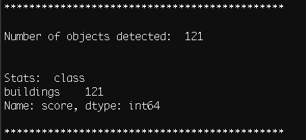

# Sagely

_Purpose_: Use OSM vector data to train a convolutional neural network (CNN) in AWS Sagemaker for building, road, (etc) object detection.

_Inputs_: Location of HOT-OSM task OR city/state/country of interest & a web-url to DG Cloud Optimized Geotif (COG).

_Outputs_: TMS (slippy map) training data using the OSM vectors + AWS Sagemaker model endpoint.


## This repo is still a work in progress! 

There are TWO parts to this workflow. The first is best illustrated by checking out the ipynb tutorial that will walk you through the OSM vector data to ML training data. Once the traing data is generated, you can use the following scripts to create a virtual environment for AWS Sagemaker training.

To use this tutorial, a good starting point will be the two ipynb (part I and part II).

[OSM ML, Part I](https://github.com/shaystrong/sagely/blob/master/osm_ml_training_pt1.ipynb)

[OSM ML, Part II](https://github.com/shaystrong/sagely/blob/master/osm_ml_training_pt2.ipynb)


### _Setup Your Machine_

This tutorial uses a Python3 virtual environment. See details below and in the setup.sh file.

You can also run the notebooks via docker. See [Docker Install and Run](#docker-install-and-run) below.


1) setup a virtual environnment: 

```console
ubuntu$ virtualenv -p python3 sagemaker_trans
ubuntu$ source sagemaker_trans/bin/activate
(sagemaker_trans) ubuntu$ cd sagemaker_trans/
```

2) Clone this repo onto your local machine.

```console
(sagemaker_trans) ubuntu$ git clone https://github.com/shaystrong/sagely.git
(sagemaker_trans) ubuntu$ cd sagely/
```

3) Run the setup. It will install necessary libraries

```console
(sagemaker_trans) ubuntu$ sh setup.sh
```

### _Download Demo Data Script_

```console
(sagemaker_trans) ubuntu$ sh get_data.sh
```

This will download the mxnet .rec files generated at the end of the part I ipynb. This will also download the full set of DG tiles that we will infer against later. 

You can start from here to run sagemaker (part II), or you can follow the label generation process from the start in part I. The part II notebook is strictly running a Sagemaker training event and creating an endpoint. 

### _Start the Notebook Server_

Start the Jupyter notebook server in the background with nohup. This creates a 'nohup.out' file where all cli logging is sent.

```console
(sagemaker_trans) ubuntu$ nohup jupyter notebook &
```

### _Docker Install and Run_

Pre-requisites: [Install docker](https://docs.docker.com/install/)

Build the docker image (will take a up to 10 minutes to run):

```bash
docker build -t sagely .
```

Run the docker container:

```bash
docker run -p 8888:8888 sagely
```

The above command should return a url like:

```
http://127.0.0.1:8888/?token=a41763eea9bf3ce73104e38dbddc161dafc175e83106eaa3
```

which you can copy / paste into a browser to open up jupyter notebook and run the notebooks described below.


### _Run the Notebooks_

Run the notebooks once your web browser pops open the Jupyter Notebook site. This is a local site running only on your machine.

[OSM ML, Part I](https://github.com/shaystrong/sagely/blob/master/osm_ml_training_pt1.ipynb)

[OSM ML, Part II](https://github.com/shaystrong/sagely/blob/master/osm_ml_training_pt2.ipynb)

### _Test the model you create_
 
Assuming you either have created an endpoint, you can predict labels using the endpoint. Edit the `test.sh` script to include your endpoint (`mod`), data location path (`pa`),and  AWS S3 role (`ro`). The threshold for object detection (`t`) may also be configured but is set for 0.6 for this test.

``` console
python3 endpoint_infer_slippygeo.py -mod <your-endpoint> \
-c buildings \
-pa tiles/ \
-ro <role>  \
-t 0.6
```

```console
(sagemaker_trans) ubuntu$ sh test.sh
```

Using the demo data discussed in the tutorial ipynb and limited rec files provided, this is the output I get. You can test my endpoint for consistency (Shay to provide).




### _Clean Up_

```console
deactivate
rm -rf /path/to/venv/sagemaker_trans/
```


## Train

See the [OSM ML, Part II](https://github.com/shaystrong/sagely/blob/master/osm_ml_training_pt2.ipynb)


## Watch!

Watch you model training on Sagemaker! You can login to the AWS console and see the progression of the learning as well as all your parameters. 


## Notes

Your OSM vector data may be messy, and or may not align with the imagery. It is up to you to manually inspect, modify, cull the training data generated for optimal model performance. There is no step presented here to do this for you. In fact, it is a critical step as a Data Scientist that you own that element.
