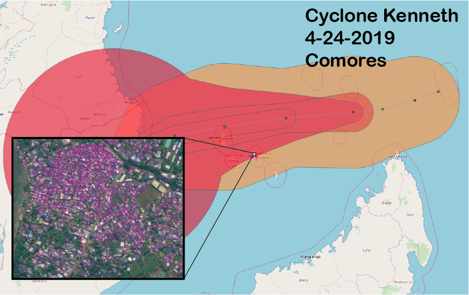

# Sagely

_Purpose_: Use OSM vector data to train a convolutional neural network (CNN) in AWS Sagemaker for building, road, (etc) object detection.

_Inputs_: Location of HOT-OSM task OR city/state/country of interest & a web-url to DG Cloud Optimized Geotif (COG).

_Outputs_: TMS (slippy map) training data using the OSM vectors + AWS Sagemaker model endpoint.



## Test

There are TWO parts to this workflow. The first is best illustrated by checking out the ipynb tutorial that will walk you through the OSM vector data to ML training data. Once the traing data is generated, you can use the following scripts to create a virtual environment for AWS Sagemaker training.

### _Setup Your Machine_

1) setup a virtual environnment: 

```console
SStrong-CRYL17$ virtualenv -p python3 sagemaker_trans
SStrong-CRYL17$ source sagemaker_trans/bin/activate
SStrong-CRYL17$ cd sagemaker_trans/
```

2) Clone this repo onto your local machine.

```console
SStrong-CRYL17$ git clone https://github.com/shaystrong/sagely.git
SStrong-CRYL17$ cd sagely/
```

3) Run the setup. It will install necessary libraries

```console
SStrong-CRYL17$ sh setup.sh
```

### _Download Script_
```console
SStrong-CRYL17$ sh get_data.sh
```

### _Test Script_
```console
SStrong-CRYL17$ sh test.sh
```

Results should look like:
  

### _Clean Up_

```console
deactivate
rm -rf /path/to/venv/sagemaker_trans/
```


## Train

## Watch!

Watch you model training on Sagemaker! You can login to the AWS console and see the progression of the learning as well as all your parameters. 

## Metrics

None Yet!

## Notes

Your OSM vector data may be messy, and or may not align with the imagery. It is up to you to manually inspect, modify, cull the training data generated for optimal model performance. There is no step presented here to do this for you. In fact, it is a critical step as a Data Scientist that you own that element.
